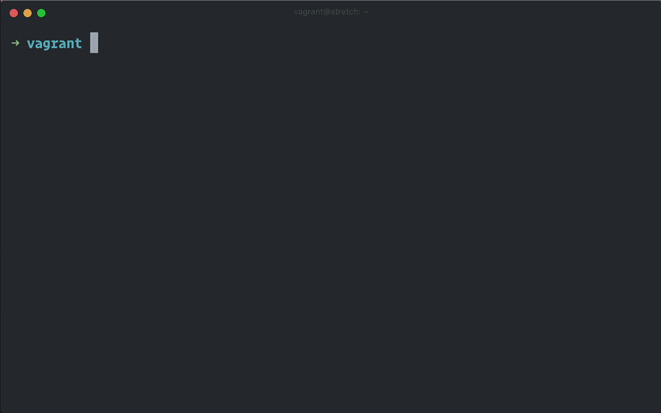

= Divine.dotfiles
:author: Grove Pyree
:email: grayarea@protonmail.ch
:revnumber: 23
:revdate: 2019.08.14
:revremark: Iterative improvement
:doctype: article
// Visual
:toc:
// Subs:

++++

<em>Bash framework for dotfiles and everything Bash</em>

++++

[#divine-dotfiles-plaque]

New machine or new OS?
Set it up with a single `*di install --yes*`.

[NOTE]
--
`di` stands for **d**ivine **i**ntervention.
--

_Divine.dotfiles_ lets you keep your set-up routines as isolated _deployments_ that are installed/removed in defined sequence.

== In a nutshell

_Divine.dotfiles_ leverages *deployments*.

A deployment is a Bash script with three specially named functions: one to check, another to install, third to remove.
Return codes are used to communicate back to the framework.
As such, authoring a deployment is akin to implementing an interface.

The goal of _Divine.dotfiles_ is *portability* and *cross-platformness* within Unix-like world.
Deployment ecosystem is designed for distribution and pluggability.
A well put together collection of deployments is able to:

* Streamline and simplify seting up new machines.
* Promote standards and best practices.

=== Example deployment

Say, you install the same command line utility on every machine.
Here's a sample deployment that does a scaled down version of that:

[source,bash,subs="verbatim,attributes"]
----
# grail/dpls/example.dpl.sh

d_dpl_check() {
  [ -e ~/bin/cmd ] && return 1 {vbar}{vbar} return 2
}

d_dpl_install() {
  cat >~/bin/cmd <<<'echo Divine.dotfiles rocks' && chmod +x ~/bin/cmd
}

d_dpl_remove() {
  rm -f -- ~/bin/cmd
}
----

And here is what working with it looks like:

[#divine-dotfiles-example-1]

Dead simple, right?
You wouldn’t need a framework for that.
But wait, there’s [.small]#_(hopefully)_# more.

=== Framework features

[header,cols="<.^1,<.^4",stripes=none]
|===

| *Divinefile*
| Special deployment that maintains a stable set of system packages across machines and OS's

| *Grail directory*
| Store your deployments and assets (e.g., personal config files) in one place.
On a new machine — plug in your Grail [.small]#_(heh)_# from a repo or a local dir with one command.

| *Priorities*
| Easily marshal your deployments in order, which is automatically reversed for uninstallation

| *Groups*
| Split your deployment collection into groups to easily handle selective installations

| *Cross-platform*
| Use built-in OS detection mechanism to perform certain tasks on certain distributions or OS families

| *Third-party deployments*
| Attach pre-made deployments from Github (such as our glorious https://github.com/no-simpler/divine-dpls-core[core bundle]) without polluting your precious Grail [.small]#_(heheh)_#

| *Stash*
| Persistent key-value store for use within your deployments

| *Assets*
| Easily separate your deployments into installation logic and dynamic content

| *Queues* and *multitasks*
| Employ built-in mechanisms for deployments that perform a series of tasks

|===

See?
_Divine.dotfiles_ is so good, it should be illegal.
And it is in some places.
Probably.

== Installation and uninstallation

=== System requirements

* https://en.wikipedia.org/wiki/Unix-like[Unix-like OS].
Following OS distributions are openly supported:
+
--
** *Debian*
** *Fedora*
** *FreeBSD*
** *macOS*
** *Ubuntu*
--
+
NOTE: This list is incomplete; you can help by expanding it.

* `bash 3.2+` and either `curl` or `wget`
+
[NOTE]
--
`git` is not a hard requirement, but it is not flaccid either.
You can install _Divine.dotfiles_ without `git`.
But then the framework will bug you with suggestions to auto-install it until you relent.
--

=== Installation

To install _Divine.dotfiles_ framework, run the following single command in Terminal:

[source,bash]
----
bash -c 'TMP=$(mktemp); URL=https://raw.github.com/no-simpler/divine-dotfiles/master/lib/install/install.sh; if curl --version &>/dev/null; then curl -fsSL $URL >$TMP; elif wget --version &>/dev/null; then wget -qO $TMP $URL; else printf >&2 "\n==> Error: failed to detect neither curl nor wget\n"; rm -f $TMP; exit 1; fi || { printf >&2 "\n==> Error: failed to download installation script\n"; rm -f $TMP; exit 2; }; chmod +x $TMP && $TMP "$@"; RC=$?; rm -f $TMP; ((RC)) && exit 3 || exit 0' bash
----

[NOTE]
--
Installation is completely safe:

* No files are overwritten.
* This repository is cloned/downloaded.
* One symlink is (optionally) created.

Oh, and you will be prompted for everything.
--

==== Installation options and overrides

Add flavoring to your installation as such:

[header,cols="<.^1,<.^4",stripes=none]
|===

2+^.^h| Prepend on the left

| `*D_FMWK_DIR=_PATH_*`
| Install framework within `*_PATH_*` instead of default `~/.divine`

| `*D_SHORTCUT_NAME=_CMD_*`
| Name shortcut shell command `*_CMD_*` instead of default `di`

| `*D_SHORTCUT_DIR=_PATH_*`
| Install shortcut shell command within `*_PATH_*` instead of choosing among directories on `$PATH`, as is default

2+^.^h| Append on the right

| `*--yes*`
| Install everything without prompts

| `*--no*`
| Install absolutely nothing

| `*--framework-yes*`
| Install framework without prompt

| `*--framework-no*`
| Install absolutely nothing (synonym of `--no`)

| `*--shortcut-yes*`
| Install shortcut shell command without prompt

| `*--shortcut-no*`
| Skip installing shortcut shell command without prompt

| `*--verbose*`
| Increase amount of output

| `*--quiet*`
| [.gray]##_(default)_## Decrease amount of output

|===

=== Uninstallation

To uninstall _Divine.dotfiles_ framework, run the following single command in Terminal:

[source,bash]
----
bash -c 'TMP=$(mktemp); URL=https://raw.github.com/no-simpler/divine-dotfiles/master/lib/uninstall/uninstall.sh; if curl --version &>/dev/null; then curl -fsSL $URL >$TMP; elif wget --version &>/dev/null; then wget -qO $TMP $URL; else printf >&2 "\n==> Error: failed to detect neither curl nor wget\n"; rm -f $TMP; exit 1; fi || { printf >&2 "\n==> Error: failed to download uninstallation script\n"; rm -f $TMP; exit 2; }; chmod +x $TMP && $TMP "$@"; RC=$?; rm -f $TMP; ((RC)) && exit 3 || exit 0' bash
----

[NOTE]
--
Uninstallation removes optional dependencies that might have been installed, and then erases framework directory.

One thing it does *_not_* do is uninstall deployments: *_you have to uninstall your deployments manually!_*
To that end, run `di remove --yes --with-!` _before_ uninstalling the framework.

By default, a copy of your usage files (including Grail dir) is retained, so even if you forget to uninstall deployments, there is potentially a way to remedy that.
--

==== Uninstallation options and overrides

Add flavoring to your uninstallation as such:

[header,cols="<.^1,<.^4",stripes=none]
|===

2+^.^h| Prepend on the left

| `*D_FMWK_DIR=_PATH_*`
| Uninstall framework within `*_PATH_*` instead of default `~/.divine`

2+^.^h| Append on the right

| `*--yes*`
| Uninstall everything without prompts

| `*--no*`
| Uninstall absolutely nothing

| `*--utils-yes*`
| Uninstall system packages installed by the framework (e.g., `git`) without prompt

| `*--utils-no*`
| Skip uninstalling system packages installed by the framework (e.g., `git`) without prompt

| `*--backup-yes*`
| [.gray]##_(default)_## Make backup of usage files (including Grail dir) without prompt

| `*--backup-no*`
| Do not make backup of usage files (including Grail dir) without prompt

| `*--framework-yes*`
| Erase framework directory without prompt

| `*--framework-no*`
| Uninstall absolutely nothing (synonym of `--no`)

| `*--verbose*`
| Increase amount of output

| `*--quiet*`
| [.gray]##_(default)_## Decrease amount of output

|===

=== Joy ride

First timer?
Looking for a feel of what _Divine.dotfiles_ offers?
Here’s a safe and fully removable way to acquaint yourself with the framework:

[source,bash]
----
bash -c 'TMP=$(mktemp); URL=https://raw.github.com/no-simpler/divine-dotfiles/master/lib/install/install.sh; if curl --version &>/dev/null; then curl -fsSL $URL >$TMP; elif wget --version &>/dev/null; then wget -qO $TMP $URL; else printf >&2 "\n==> Error: failed to detect neither curl nor wget\n"; rm -f $TMP; exit 1; fi || { printf >&2 "\n==> Error: failed to download installation script\n"; rm -f $TMP; exit 2; }; chmod +x $TMP && $TMP "$@"; RC=$?; rm -f $TMP; ((RC)) && exit 3 || exit 0' bash --yes \
&& ~/.divine/intervene.sh attach core --yes \
&& ~/.divine/intervene.sh install --yes --with-!
----

[NOTE]
--
This chained command does three things:

. Install the framework without any prompts.
. Attach our illustrious https://github.com/no-simpler/divine-dpls-core[core bundle] of Divine deployments.
. Run deployment installation routine.

Divine deployments *_never overwrite_* pre-existing files on your system without backing them up.

Everything that is backed up is *_automatically restored_* upon uninstallation.
--

All's fair: in case you remain unsatisfied, here are the separate 'undo' steps, in order:

[source,bash]
----
# Uninstall Divine deployments, restoring everything to pre-installation state:
~/.divine/intervene.sh remove --yes --with-!

# Detach Divine deployments from your copy of the framework:
~/.divine/intervene.sh detach core --yes

# Erase the framework without keeping backups:
bash -c 'TMP=$(mktemp); URL=https://raw.github.com/no-simpler/divine-dotfiles/master/lib/uninstall/uninstall.sh; if curl --version &>/dev/null; then curl -fsSL $URL >$TMP; elif wget --version &>/dev/null; then wget -qO $TMP $URL; else printf >&2 "\n==> Error: failed to detect neither curl nor wget\n"; rm -f $TMP; exit 1; fi || { printf >&2 "\n==> Error: failed to download uninstallation script\n"; rm -f $TMP; exit 2; }; chmod +x $TMP && $TMP "$@"; RC=$?; rm -f $TMP; ((RC)) && exit 3 || exit 0' bash --yes --backup-no
----

After the three 'undo' steps have successfully run, there is no trace of _Divine.dotfiles_ on your system.
[.small]#_(Sigh.)_#

== Framework structure

_Divine.dotfiles_ is installed, by default, to `~/.divine/`, and is contained entirely in that directory, except:

* Symlink to the framework's main executable is created somewhere on `$PATH`.
* Your deployments may do to the system pretty much anything.

The framework itself consists of the following main parts:

[header,cols="<.<1,<.<4",stripes=none]
|===

| [#grail_directory]#`~/.divine/*grail/*`#
a| *Grail directory* provides space for user’s deployments and assets.

[NOTE]
--
If you settle on using _Divine.dotfiles_, we recommend taking Grail directory under version control and syncing it, e.g., via cloud services or Github.
--

Sub-structured as follows:

* `*assets/*` — Directory for user's assets, such as config files.
* `*dpls/*` — Directory for user's deployments.
* `.stash.cfg` — Grail stash entries _(file maintained by the framework)_.
* `.stash.cfg.md5` — Grail stash integrity checksum _(file maintained by the framework)_.

| [#state_directory]#`~/.divine/*state/*`#
a| *State directory* carries the state of deployments on current machine.
_(Entire directory is maintained by the framework.)_

Sub-structured as follows:

* `*backups/*` — _Divine.dotfiles_ provides facilities to back up existing files from the system.
This directory stores such backups.
* `*dpl-repos/*` — _Divine.dotfiles_ provides facilities to attach third-party deployments from Github.
This directory stores such deployments.
* `*stash/*` — _Divine.dotfiles_ provides a persistent key-value store for use within deployments.
This directory houses key-value containers.

| [#lib_directory]#`~/.divine/*lib/*`#
| Guts of the framework, structured to the best of creator's ability.
_(Entire directory is, naturally, maintained by the framework.)_

| `~/.divine/intervene.sh`
| *Divine intervention utility*, the command line interface to the framework.
_(File is maintained by the framework.)_

| `[$PATH directory]/di`
| Symlink to the intervention utility, providing an easy access.
This symlink is usually auto-created during framework installation.

|===

== Usage

=== Divine intervention utility `di`

_Divine.dotfiles_ provides command line interface via *Divine intervention utility `di`*.

Intervention utility does:

. *Primary routines* on deployments (and Divinefiles):
.. *Check* whether deployments are installed or not.
.. *Install* deployments.
.. *Uninstall* deployments.
. *Attach/detach* third-party deployments from Github.
. *Plug* in your pre-made Grail directory from a repository or local directory.
. *Update* framework itself, attached deployments, and Grail directory, if it is a cloned repository.

=== Checking/installing/removing deployments

Primary routines — bread-and-butter of the framework — launch respective functions on deployments.

[source,bash,subs="verbatim,attributes,quotes"]
----
$ *di* *c*[*heck*]    [-ynqvewf] [--] [*_NAME_*]…

$ *di* *i*[*nstall*]  [-ynqvewf] [--] [*_NAME_*]…

$ *di* *r*[*emove*]   [-ynqvew]  [--] [*_NAME_*]…
----

Accepted values of `*_NAME_*` are (case-insensitive):

* Names of <<_deployments,deployments>>.
* Reserved synonyms for <<_divinefiles,Divinefiles>>: `divinefile`, `dfile`, `df`.
* Single-digit names of <<deployment_groups,deployment groups>>: `0`, `1`, `2`, `3`, `4`, `5`, `6`, `7`, `8`, `9`.
* Without any arguments, all deployments are processed.

Deployments (and Divinefiles) are retrieved from two locations (at any depth):

* Directory for user's deployments: `~/.divine/grail/dpls`.
* Directory for attached deployments: `~/.divine/state/dpl-repos`.

==== Filtering deployments

* Without any arguments, all deployments are processed.
* Particular deployments are requested by listing their names or <<deployment_groups,single-digit group names>>, in any combination.
* <<dangerous_deployments,Dangerous>> deployments are ignored:
** unless requested by name (not by single-digit group name),
** or unless `--with-!`/`-w` option is used.
* Option `--except`/`-e` inverts filtering: all deployments are processed, _except_ those listed.
Note, that without any arguments, this is a no-opt.
+
In this mode, dangerous deployments are still filtered out by default.

==== Primary routine options

Below is the list of primary routine options.
Additional info about routine's behavior is also given.

[header,cols="<.<1,<.<4",stripes=none]
|===

| `*-y*`, `*--yes*`
| Normally, framework prompts user right before sourcing each deployment script.
Other events — like offering an optional framework dependency — also trigger a prompt.

With this option, affirmative answer is assumed to every non-<<urgent_prompt,urgent>> prompt.

Note, that deployments are free to add any number of custom prompts unaffected by this option.

Access within deployments: `$D__OPT_ANSWER` (`true` / `false` / _empty_).

| `*-n*`, `*--no*`
| With this option, negatory answer is assumed to every built-it prompt.
This option is equivalent to a 'dry run' — apart from skip messages, nothing will actually be done.

Access within deployments: `$D__OPT_ANSWER` (`true` / `false` / _empty_).

| `*-f*`, `*--force*`
a| By default, framework does *not*:

* re-install deployments that appear already installed;
* uninstall deployments that appear already not installed;
* process deployments that appear installed by means other than this framework.

This option overrules such considerations.

Access within deployments: `$D__OPT_FORCE` (`true` / `false`).

| `*-e*`, `*--except*`
| This option inverts the behavior of deployment filter: instead of processing only listed deployments, all deployments are processed _except_ listed.

Access within deployments: `$D__OPT_INVERSE` (`true` / `false`).

| `*-w*`, `*--with-!*`
| By default framework ignores <<dangerous_deployments,dangerous deployments>> unless they are named explicitly.
This option disables such behavior.

Access within deployments: `$D__OPT_EXCLAM` (`true` / `false`).

| `*-v*`, `*--verbose*`
| Increase amount of output

Access within deployments: `$D__OPT_QUIET` (`true` / `false`).

| `*-q*`, `*--quiet*`
| [.gray]##_(default)_## Decrease amount of output

Access within deployments: `$D__OPT_QUIET` (`true` / `false`).

|===

[NOTE]
--
Even though every option above serves a function within the framework, it is also up to deployment authors to honor their semantics.
--

=== Attaching third-party deployments

Beside using own deployments, _Divine.dotfiles_ allows to attach (i.e., import) deployments distributed via Github repositories.

[source,bash,subs="verbatim,attributes,quotes"]
----
$ *di* *a*[*ttach*] [-yn] [--] *_REPO_*…

$ *di* *d*[*etach*] [-yn] [--] *_REPO_*…
----

Accepted values of `*_REPO_*` are (case-insensitive):

* Github repository in the form: `no-simpler/divine-dpls-core`.
* Specifically for Divine deployments, a shorthand is accepted:
+
`*_NAME_*` (must not contain `/`) translates to `no-simpler/divine-dpls-*_NAME_*`

Detaching deployments deletes the copy of their repository, but it is up to you to:

* Uninstall the deployments beforehand (re-attach if you forgot).
* Remove any assets that might have been copied into your <<grail_directory,Grail>> assets directory.

[NOTE]
--
Attached repositories are cloned/downloaded into your <<state_directory,state directory>>, but attachment records are stored in <<grail_directory,the Grail>>.
On every launch, intervention utility synchronizes Grail records with actual repositories in state directory.

Thus, by synchronizing Grail between machines, you will have the same set of both custom and attached deployments everywhere.
--

==== Attach/detach routine options

Below is the list of options for attaching/detaching third-party deployments.
Additional info about routine's behavior is also given.

[header,cols="<.<1,<.<4",stripes=none]
|===

| `*-y*`, `*--yes*`
| Normally, framework prompts user right before cloning/downloading repository.
Other events — like offering an optional framework dependency — also trigger a prompt.

With this option, affirmative answer is assumed to every built-it prompt.

| `*-n*`, `*--no*`
| With this option, negatory answer is assumed to every built-it prompt.
This option is equivalent to a 'dry run' — apart from skip messages, nothing will actually be done.

|===

=== Plugging the Grail

If you have a copy of your carefully crafted <<grail_directory,Grail directory>> stored somewhere, _Divine.dotfiles_ lets you easily plug it in.

[source,bash,subs="verbatim,attributes,quotes"]
----
$ *di* *p*[*lug*] [-ynl] [--] *_ADDRESS_*
----

Accepted values of `*_ADDRESS_*` are:

* Github repository in the form: `username/repo-name`.
* Path to a generic git repository.
* Path to a local directory.

Repositories are cloned, directories are copied.
Note, that existing Grail directory will be utterly destroyed in the process.

If provided argument can be interpreted in multiple ways, the framework will iterate over possible options in the order they are given above.

==== Plug routine options

Below is the list of options for plugging in <<grail_directory,Grail directory>>.
Additional info about routine's behavior is also given.

[header,cols="<.<1,<.<4",stripes=none]
|===

| `*-y*`, `*--yes*`
a| Normally, framework prompts user right before overwriting existing Grail directory.
Other events — like offering an optional framework dependency — also trigger a prompt.

With this option, affirmative answer is assumed to every built-it prompt.

[NOTE]
--
If provided argument can be interpreted in multiple ways, the first option will be silently settled upon.
--

| `*-n*`, `*--no*`
| With this option, negatory answer is assumed to every built-it prompt.
This option is equivalent to a 'dry run' — apart from skip messages, nothing will actually be done.

| `*-l*`, `*--link*`
| With this option, symlink is created to the directory, path to which is given, instead of copying it.
In this mode, given argument is not considered as a repository.

|===

=== Updating framework and deployments

[source,bash,subs="verbatim,attributes,quotes"]
----
$ *di* *u*[*pdate*] [-yn] [--] [*f*[*ramework*]] [*g*[*rail*]] [*d*[*eployments*]]
----

Update routine is three-pronged, and you are free to engage any and all of the prongs:

* `*f*` or `*framework*` — pulls latest revision of _Divine.dotfiles_.
* `*g*` or `*grail*` — pulls latest revision of <<grail_directory,Grail directory>>, _if_ it is a <<_plugging_the_grail,plugged>> repository.
* `*d*` or `*deployments*` — pulls latest revision of every <<_attaching_third_party_deployments,_attached_>> deployment repository.
* Without any arguments, all of the above are performed.

==== Updating routine options

Below is the list of options for updating framework, <<grail_directory,the Grail>>, and <<_attaching_third_party_deployments,attached deployments>>.
Additional info about routine's behavior is also given.

[header,cols="<.<1,<.<4",stripes=none]
|===

| `*-y*`, `*--yes*`
a| Normally, framework prompts user right before pulling from remote repository.
Other events — like offering an optional framework dependency — also trigger a prompt.

With this option, affirmative answer is assumed to every built-it prompt.

| `*-n*`, `*--no*`
| With this option, negatory answer is assumed to every built-it prompt.
This option is equivalent to a 'dry run' — apart from skip messages, nothing will actually be done.

|===

== Deployments

A _Divine.dotfiles_ *deployment* is a Bash script named in `*_DPL-NAME_*.dpl.sh` pattern.
`*_DPL_NAME_*` must be non-empty.

To be picked up by the framework, deployments must be located at any depth under two recognized deployment directories:

* `~/.divine/grail/dpls` — user's deployments.
Create your deployments here.
* `~/.divine/state/dpl-repos` — attached third-party deployments.
This one is maintained by the framework.

=== Deployment structure

The minimal valid deployment is an empty file.
As such, it does nothing but appear in framework output.

Deployments are written in Bash syntax (with some limitations on metadata).
Each deployment is sourced by Bash interpreter no more than once per intervention routine.

A deployment is formed by:

* implementing specially named Bash functions (*primaries*);
* assigning to specially named variables (*metadata*).

=== Primary functions

*Primary functions*, or *primaries*, correspond to three fundamental actions performed upon a deployment:

* `d_dpl_check()` — checks whether deployment is installed or not.
* `d_dpl_install()` — installs deployment.
* `d_dpl_remove()` — uninstalls (reverses previous installation of) deployment.

This section includes semantic meanings behind primaries and their return codes.
Feel free to stretch semantic guidelines according to your particular use case.

==== Primary function `d_dpl_check()`

If this function is implemented, it will be called:

* During `check` routine — to determine status and show relevant output.
* During `install` routine — to determine whether installation is necessary/possible.
* During `remove` routine — to determine whether uninstallation is necessary/possible.

Return code of `d_dpl_check()` determines current status of the deployment:

[%header,cols="^.<1,<.<4",stripes=none]
|===

^.^| Return code of `d_dpl_check()`
^.^| Interpretation

| `0`
a| *'Unknown'*: [.gray]##_(default)_## no reliable way to tell whether this deployment is installed or not.

_This return code is assumed if `d_dpl_check()` is not implemented or if unsupported code is returned._

Routines that will proceed further:

* `install`
* `remove`

| `1`
a| *'Installed'*: as it stands, intended goal of installing this deployment is entirely achieved.

Routines that will proceed further:

* `remove`

| `2`
a| *'Not installed'*: as it stands, intended goal of installing this deployment is entirely not achieved.

Routines that will proceed further:

* `install`

| `3`
a| *'Irrelevant'*: processing this deployment in current environment does not make sense.

This code is appropriate, for example, if current OS is unsupported.

None of the routines will proceed further.

| `4`
a| *'Partly installed'*: as it stands, intended goal of installing this deployment is partly achieved and partly not achieved.

This code differs from 'Unknown' in semantics and output styling.

Routines that will proceed further:

* `install`
* `remove`

|===

==== Primary function `d_dpl_install()`

If this function is implemented, it will be called during `install` routine — to achieve the intended goal of this deployment.

Return code of `d_dpl_install()` determines output of `install` routine:

[%header,cols="^.<1,<.<4",stripes=none]
|===

^.^| Return code of `d_dpl_install()`
^.^| Interpretation

| `0`
| *'Successfully installed'*: [.gray]##_(default)_## intended goal of installing this deployment is entirely achieved.

_This return code is assumed if `d_dpl_install()` is not implemented or if unsupported code is returned._

| `1`
| *'Failed to install'*: intended goal of installing this deployment is _not entirely_ achieved due to error.

| `2`
| *'Skipped'*: intended goal of installing this deployment is _entirely not_ achieved because nothing has been done.

| `100`
a| *'Reboot needed'*: same as 'Successfully installed', except:

* Intervention will gracefully shut down without moving past this deployment.
* User will be asked to reboot the machine and continue afterward.

| `101`
a| *'User attention needed'*: same as 'Successfully installed', except:

* Intervention will gracefully shut down without moving past this deployment.
* Deployment is expected to print explanation to `stdout`.

| `102`
a| *'Critical failure'*: same as 'Failed to install', except:

* Intervention will shut down without moving past this deployment.
* Output will mention critical failure.

|===

==== Primary function `d_dpl_remove()`

If this function is implemented, it will be called during `remove` routine — to reverse the effects of previously installing this deployment.

Return code of `d_dpl_remove()` determines output of `remove` routine:

[%header,cols="^.<1,<.<4",stripes=none]
|===

^.^| Return code of `d_dpl_remove()`
^.^| Interpretation

| `0`
| *'Successfully installed'*: [.gray]##_(default)_## intended goal of installing this deployment is entirely achieved.

_This return code is assumed if `d_dpl_remove()` is not implemented or if unsupported code is returned._

| `1`
| *'Failed to install'*: intended goal of installing this deployment is _not entirely_ achieved due to error.

| `2`
| *'Skipped'*: intended goal of installing this deployment is _entirely not_ achieved because nothing has been done.

| `100`
a| *'Reboot needed'*: same as 'Successfully installed', except:

* Intervention will gracefully shut down without moving past this deployment.
* User will be asked to reboot the machine and continue afterward.

| `101`
a| *'User attention needed'*: same as 'Successfully installed', except:

* Intervention will gracefully shut down without moving past this deployment.
* Deployment is expected to print explanation to `stdout`.

| `102`
a| *'Critical failure'*: same as 'Failed to install', except:

* Intervention will shut down without moving past this deployment.
* Output will mention critical failure.

|===

=== Deployment metadata

*Deployment metadata* (posing as variable assignments) alter deployment's appearance and behavior:

* `D_DPL_NAME` — explicit name for the deployment.
* `D_DPL_DESC` — one-line description of the deployment.
* `D_DPL_PRIORITY` — priority of the deployment (non-negative integer).
* `D_DPL_FLAGS` — one-character flags, causing special treatment.
* `D_DPL_WARNING` — one-line cautionary message about this deployment.

[NOTE]
--
Although all deployment metadata look like Bash variable assignments, they are in face extracted from the file _before_ it is interpreted by Bash.

For each reserved 'variable' name, first line that looks like the usual Bash assignment is used.

With that in mind, follow these simple rules for deployment metadata:

* Write one 'assignment' per line, without line continuation.
* Do not use Bash substitutions or comments.
* Avoid leading and trailing whitespace, as well as whitespace around the `=`.
* Matching quotes around the value are allowed (they are stripped in the processing).
--

==== Deployment name and description

[source,bash]
----
D_DPL_NAME=example
D_DPL_DESC='Simple description that shows in deployment prompts'
----

While *description* is mostly cosmetic, deployment *name* is very important.
It is the single unique identifier for every deployment, and is used to invoke primary routines on it.
As such, the framework forbids having more than one deployment sharing a name.

If deployment name is not provided explicitly, file name is used instead, sans `.dpl.sh` suffix.
Deployment names are case insensitive.

==== Deployment priority

[source,bash]
----
D_DPL_PRIORITY=420
----

Priority is the way to impose order on deployment processing.

During `check` and `install` routines, deployments are sorted in ascending order (smaller integer values go first).
During `uninstall` routine, the order is fully reversed.
Order of deployments with the same priority is undefined.

Priority must be a non-negative integer, otherwise it falls back to the default value of `4096`.

==== Deployment flags

[source,bash]
----
D_DPL_FLAGS=ci!89
----

Flags alter some of the framework's behavior toward the deployment.

* A flag is a single non-whitespace character.
* Any number of flags can be put together in any order.
* Repeating a flag does not bear any additional significance.
* There is no way to unset a flag, apart from not setting it.
* Unsupported flags are silently ignored.

Below is the exhaustive rundown of supported flags and their effects.

[%header,cols="^.<1,<.<4",stripes=none]
|===

^.^| Flag character (regex)
^.^| Effect on deployment handling

| [#deployment_groups]#`[0-9]`#
a| Assigns the deployment to one of the ten single-digit *groups*.
Groups of deployments may be processed together by referring to them by that group's digit in place of deployment name.

[NOTE]
--
Consequently, a deployment may not be named with a single digit.
The framework guards against using reserved deployment names.
--

| [#dangerous_deployments]#`!`#
| Marks the deployment as *dangerous*.
By default, framework ignores dangerous deployments unless they are listed by name or by name of their group.
Another way to include dangerous deployments is the `--with-!`/`-w` option on intervention utility.

| [#urgent_prompt]#`[cira]`#
a| Intervention utility has the `--yes`/`-y` option that effectively skips all normal prompts and confirmations.
It is possible to force the appearance of an *urgent prompt* before the deployment is sourced regardless of said option.
To do so, use any of these flags:

* `c` — always prompt during `check` routine.
* `i` — always prompt during `install` routine.
* `r` — always prompt during `remove` routine.
* `a` — all of the avove.

When a prompt is forced by a flag, it remains urgent even without `--yes` option.
Urgent prompts are styled to stand out a bit more in terminal.

|===

==== Deployment warning

[source,bash]
----
D_DPL_WARNING="Warning for 'urgent' prompts forced by a flag"
----

If such warning is provided, it will accompany every urgent prompt enforced by a deployment flag.

== Divinefiles

A *Divinefile* is a special kind of deployment.
Its purpose is akin to that of https://github.com/Homebrew/homebrew-bundle[Brewfile] or https://bundler.io/gemfile.html[Gemfile].
A Divinefile is a manifest of system utilities to be maintained using supported system package managers.

* A Divinefile must be named, well, `Divinefile`.
* There can absolutely be more than one — their contents are effectively merged.
* The framework picks up every Divinefile located at any depth under two recognized deployment directories:
** `~/.divine/grail/dpls` — user's Divinefiles. Create yours here.
** `~/.divine/state/dpl-repos` — attached third-party Divinefiles.
* As a kind of deployment, Divinefiles are referred to by their collective reserved name, `Divinefile` (or synonyms `dfile`, `df`).

[NOTE]
--
Yes, you also cannot name regular deployments `divinefile`, `dfile`, or `df`.
The framework guards against using reserved deployment names.
--

=== Divinefile usage

During an intervention, Divinefiles may only be referred to collectively.
They are processed in their merged entirety, or not processed at all.

You can nevertheless assign deployment-style *priorities and flags* to individual packages within Divinefiles.
Packages are intertwined with regular deployments in a shared workflow.

[NOTE]
--
For more complex system package installations, e.g., involving particular versions or special package manager options, use regular deployments.
--

=== Divinefile syntax

Divinefiles are processed in terms of lines.

Simplest line contains a list of whitespace-delimited package names.
Each package is then individually checked/installed/uninstalled during relevant routines:

[source,bash]
----
pkg1 pkg2
----

[NOTE]
--
For Divinefiles in general, whitespace rules are fairly permissive.
Whitespace separates ``WORD``s and is otherwise insignificant.
--

==== Alt-lists

Within a line, each `|` (vartical bar) starts an alt-list.
An alt-list is specific to a particular package manager.
If an alt-list is provided for currently detected package manager, it overrides the original list entirely.

[source,bash]
----
pkg1 | apt-get: pkg1 pkg2 | dnf: pkg3
----

Within an alt-list, everything to the left of first `:` (colon) is read as package manager name.
Everything to the right — as whitespace-delimited alt-list of package names for that package manager

[NOTE]
--
Package manager name is matched against `$D__OS_PKGMGR` built-in variable.
--

==== Package priority and flags

Similarly to regular deployments, each valid line in Divinefile may have priority and flags.
These may be set at the beginning of the line (before any package lists) within individual pairs of parentheses:

[source,bash]
----
(priority: 1000)              pkg1 pkg2

(flags: ir)                   pkg3 | yum: pkg4

(priority: 500) (flags: r)    pkg5
----

With regard to flags, a shorthand is provided, that works by *appending* provided flags as opposed to overriding them as is normal:

[source,bash]
----
(i) pkg1        # Parentheses must not contain ':'

( r0! ) pkg2    # Multiple flags may be given too
----

==== OS-specific packages

Lines may be made exclusive to particular OS family or distribution.
Multiple OS's may be given by separating with vartical bars:

[source,bash]
----
(os: debian)      pkg1

(os: macos|bsd)   pkg2

(os: all)         pkg3    # Keywords 'all'/'any' are reserved to denote any OS
----

[NOTE]
--
Each OS name is matched against `$D\__OS_FAMILY` and `$D__OS_DISTRO` built-in variables.
Single match against any of the two is sufficient.
--

[[kv]]
==== Key-values

All parenthesized key-values, when they appear on a line without any package lists, come into effect until the end of the file, or until another value is assigned to the same key:

[source,bash]
----
pkg1                  # Any OS, priority 4096 (default)

( os : macos )(priority:333)    ## These will remain in effect until 
                                #. end of file or until overridden

pkg2                  # macOS-only, priority 333
(priority:69) pkg3    # macOS-only, priority 69
pkg4                  # macOS-only, priority 333
----

==== Comments and line continuation

Hash/pound symbol (`#`) comments out the rest of the line.

A line may be 'glued' to the next by terminating it with a backslash (`\`):
[source,bash]
----
(os: fedora) \    ## This is a single logical line
pkg1 pkg2    \    #. spanning three actual lines
| yum: pkg3       #. (yes, even with comments attached like this)
----

==== Divinefile example

[source,bash]
----
git                       ## Means:
                          #.  * priority: 4096 (default)
                          #.  * packages: git

(priority:300)  \         ## Means:
(r)             \         #.  * priority: 300
node            \         #.  * flags: 'always prompt before removing'
| apt-get: nodejs npm     #.  * packages (on apt-get): nodejs npm
                          #.  * packages (anywhere else): node
----

== Advanced features

_Divine.dotfiles_ offers mechanisms that facilitate creation of better, stronger, faster deployments.

=== Deployment guidelines

==== Variables available to deployments

==== OS detection and support

=== Stash

=== Assets

==== Asset manifests

=== Queues

==== Generic queue

==== Queue manifest

==== Link queue

==== Copy queue

==== Split queue

=== Multitask

=== Debug output